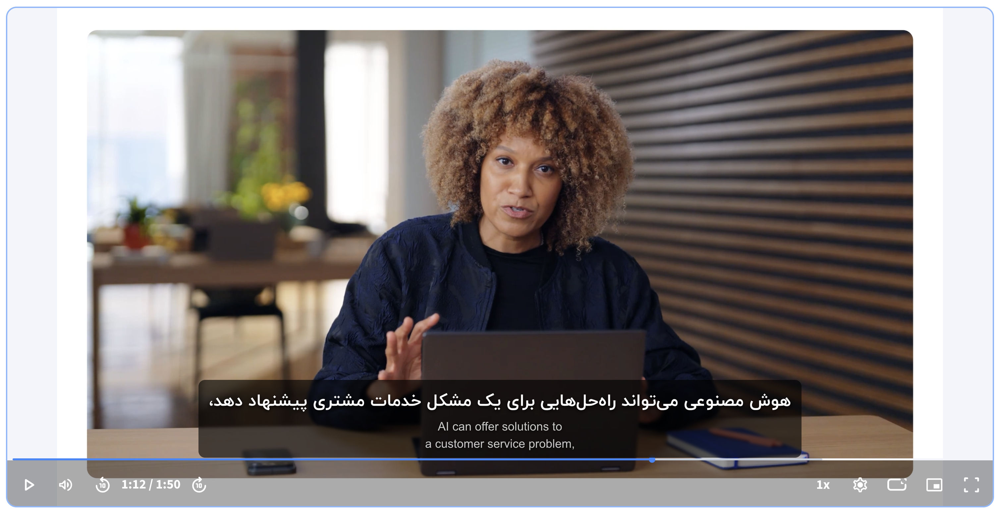
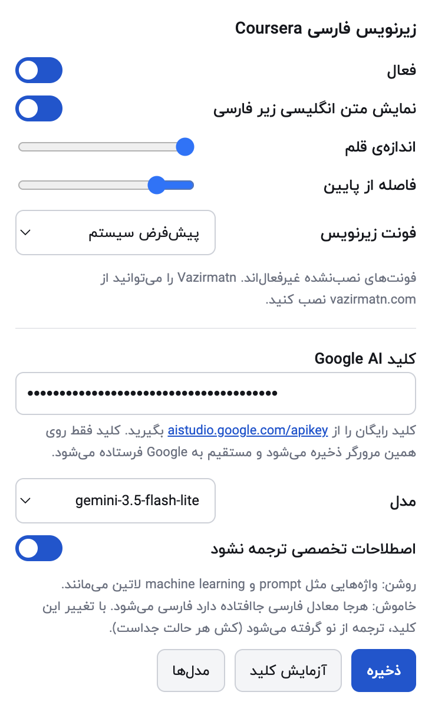

# زیرنویس فارسی زنده

اکستنشن کروم که در لحظه زیرنویس انگلیسی ویدیو را فارسی می‌کند و به‌صورت
دوزبانه (فارسی بالا، انگلیسی اصلی زیرش) روی خود پلیر نشان می‌دهد.



## سایت‌های پشتیبانی‌شده

| سایت | منبع کیو | وضعیت |
|---|---|---|
| Coursera | `video.textTracks` | آزموده‌شده |
| Vimeo | `video.textTracks` | آزموده‌شده روی صفحه‌ی ویدیو در vimeo.com |

اکستنشن خودش تشخیص می‌دهد روی کدام سایت است، منبع کیوی همان سایت را
برمی‌دارد و تنظیمات ظاهری همان سایت را اعمال می‌کند.

## چطور کار می‌کند

منبع متن، **زیرنویس انگلیسی خود سایت** است، نه تشخیص گفتار. اکستنشن تراک
زیرنویس را روی عنصر `<video>` پیدا می‌کند (`video.textTracks`)، آن را در
حالت `hidden` می‌گذارد تا کیوها با تایمینگ دقیق لود شوند بدون اینکه مرورگر
رسمشان کند، و بعد خودش روی ویدیو رسم می‌کند.

دو ریزه‌کاری که در عمل لازم شدند:

- **پلیر مود تراک را پس می‌گیرد.** هم Coursera و هم Vimeo بعد از لود شدن
  مدیا تراک را به `disabled` برمی‌گردانند و `track.cues` تهی می‌شود. تراک
  با یک شنونده‌ی `change` و تثبیت دوباره در نگهبان یک‌ثانیه‌ای روی `hidden`
  نگه داشته می‌شود.
- **بزرگ‌ترین ویدیوی صفحه لزوماً آنی نیست که زیرنویس دارد.** Vimeo پلیر
  اصلی را با تأخیر می‌چیند در حالی که یک پلیر کوچک بدون زیرنویس روی صفحه
  است. پس ویدیویی که تراک قابل‌استفاده دارد برنده است و مساحت فقط
  تساوی‌شکن است.

ترجمه با **Google AI (Gemini)** انجام می‌شود:

- کل زیرنویس در دسته‌های ۴۰ خطی فرستاده می‌شود، نه خط‌به‌خط، تا جمله‌هایی
  که در چند کیو شکسته شده‌اند درست ترجمه شوند.
- سه خط قبل از هر دسته به‌عنوان زمینه فرستاده می‌شود (ترجمه نمی‌شود).
- خروجی با `responseSchema` به‌شکل آرایه‌ی رشته اجبار می‌شود تا تعداد خط‌ها
  با ورودی یکی بماند.
- کلید «اصطلاحات تخصصی ترجمه نشود» قاعده‌ی چهارم پرامپت را عوض می‌کند: یا
  اصطلاح لاتین دست‌نخورده می‌ماند، یا هرجا معادل فارسی جاافتاده دارد فارسی
  می‌شود. کش هر دو حالت جداست، پس عوض کردنش ترجمه‌ی قدیمی را برنمی‌گرداند.
- اول دسته‌ای ترجمه می‌شود که پخش همان‌جاست، بعد جلو می‌رود و آخر به عقب
  برمی‌گردد — پس لازم نیست منتظر ترجمه‌ی کل ویدیو بمانید.
- کیوهای صفرطول (زیرنویس خودکار ویمیو چندتایی دارد) حذف می‌شوند؛ شرط نمایش
  برایشان هرگز برقرار نمی‌شود، پس ترجمه‌شان فقط سهمیه می‌سوزاند.
- هر دسته در `chrome.storage.local` کش می‌شود؛ تماشای دوباره‌ی همان ویدیو
  هیچ درخواستی به API نمی‌فرستد.

تا وقتی ترجمه‌ی یک خط نرسیده، همان خط انگلیسی نمایش داده می‌شود تا صفحه
خالی نماند.

## نصب

۱. کروم → `chrome://extensions`
۲. **Developer mode** را روشن کنید.
۳. **Load unpacked** → همین پوشه را انتخاب کنید.

## تنظیم کلید

۱. کلید رایگان را از <https://aistudio.google.com/apikey> بگیرید.
۲. روی آیکن اکستنشن بزنید، کلید را در کادر «کلید Google AI» بگذارید و
   **ذخیره** کنید.
۳. با دکمه‌ی **آزمایش کلید** درستی‌اش را بسنجید؛ با **مدل‌ها** فهرست
   مدل‌های در دسترس کلیدتان را بگیرید.

کلید فقط در همین مرورگر ذخیره می‌شود و تنها service worker آن را می‌خواند؛
content script هرگز کلید را نمی‌بیند.

## تنظیمات popup



بالای پنل نوشته می‌شود این تب روی کدام سایت است. تنظیمات ظاهری **برای هر
سایت جدا** ذخیره می‌شوند، چون نوار کنترل پلیرها هم‌ارتفاع نیست؛ تنظیمات
ترجمه سراسری‌اند.

| گزینه | دامنه | کار |
|---|---|---|
| فعال | سراسری | روشن/خاموش کردن کامل زیرنویس |
| نمایش متن انگلیسی | هر سایت | نشان دادن یا پنهان کردن خط انگلیسی زیر فارسی |
| اندازه‌ی قلم | هر سایت | بزرگی متن فارسی (انگلیسی متناسب با آن) |
| فاصله از پایین | هر سایت | جابه‌جایی عمودی تا روی نوار کنترل نیفتد |
| فونت زیرنویس | هر سایت | فونت‌های نصب‌نشده روی دستگاه غیرفعال نشان داده می‌شوند |
| اصطلاحات تخصصی ترجمه نشود | سراسری | اصطلاح فنی لاتین بماند یا معادل فارسی بگیرد |
| مدل | سراسری | مدل Gemini؛ پیش‌فرض `gemini-3.5-flash-lite` |
| پاک کردن کش | سراسری | خالی کردن ترجمه‌های ذخیره‌شده |

اندازه‌ی قلم و فاصله با عرض پلیر مقیاس می‌شوند، پس در حالت تمام‌صفحه هم
درست می‌ماند. فهرست فونت‌ها با اندازه‌گیری عرض متن تشخیص می‌دهد کدام فونت
واقعاً روی دستگاه نصب است و بقیه را غیرفعال می‌کند؛ هر انتخاب دنباله‌ی
فالبک دارد تا اگر فونت نبود متن نشکند.

## محدودیت‌ها

- ویدیویی که زیرنویس انگلیسی ندارد ترجمه نمی‌شود؛ پیام «این ویدیو زیرنویس
  انگلیسی ندارد» نشان داده می‌شود.
- یوتیوب با این سازوکار کار نمی‌کند: `video.textTracks` آنجا خالی است و
  زیرنویس با DOM رسم می‌شود. افزودنش آداپتور جداگانه لازم دارد.
- سهمیه‌ی رایگان Google AI محدودیت نرخ دارد. اگر به آن بخوردید، پیام خطا
  روی ویدیو می‌آید و اکستنشن با تأخیر دوباره تلاش می‌کند.

## افزودن سایت تازه

در `content.js` یک ورودی به جدول `SITES` اضافه کنید:

```js
{ id: 'example', label: 'Example', source: 'texttracks',
  match: (h) => /(^|\.)example\.com$/i.test(h),
  defaults: { bottomOffset: 64 } }
```

اگر سایت کیوهایش را جای دیگری نگه می‌دارد، یک ورودی تازه در `SOURCES` با
همان قرارداد (`candidate`، `acquire`، `cues`، `hold`، `ready`، `watch`،
`release`) بنویسید. هسته دست نمی‌خورد.

## فایل‌ها

| فایل | نقش |
|---|---|
| `content.js` | تشخیص سایت، آداپتور منبع کیو، ساخت پوشش، هم‌زمانی |
| `background.js` | تماس با Gemini، دسته‌بندی، کش، تلاش دوباره |
| `overlay.css` | ظاهر زیرنویس |
| `popup.html/js` | تنظیمات و مدیریت کلید |

---

## In English

A Chrome extension that adds live Persian subtitles to Coursera and Vimeo
videos.

It reads the site's own English caption track from the `<video>` element
(`video.textTracks`, held in `hidden` mode so cues load with exact timings
without the browser rendering them), translates the cues with the Google AI
(Gemini) API, and draws a bilingual overlay on the player — Persian on top,
the original English underneath.

The script recognises which site it is on, picks the cue source that site
needs, and applies that site's own appearance settings. Adding a site means
one entry in the `SITES` table, or one new adapter in `SOURCES` if the site
keeps its cues somewhere else.

Translation runs in batches of 40 cues with three preceding lines as context,
uses a JSON array `responseSchema` so the line count always matches, starts
from the batch you are currently watching, and caches every batch in
`chrome.storage.local` so re-watching costs nothing.

Bring your own free API key from <https://aistudio.google.com/apikey>. The key
is stored locally and only ever read by the service worker.

MIT licensed.
